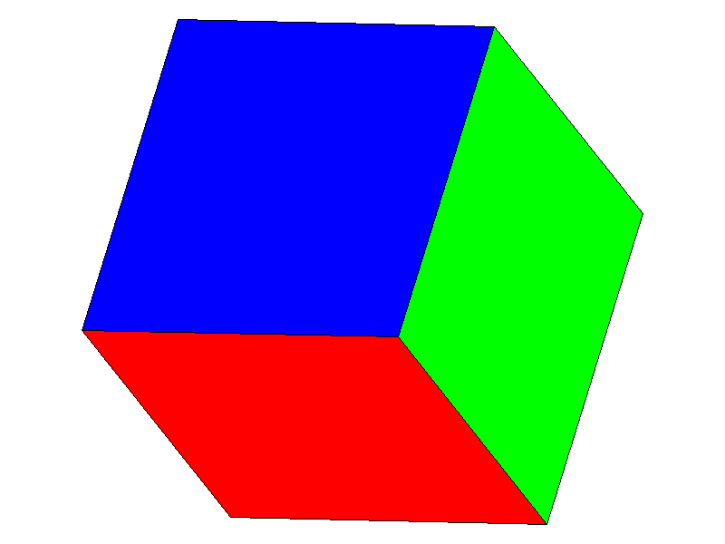
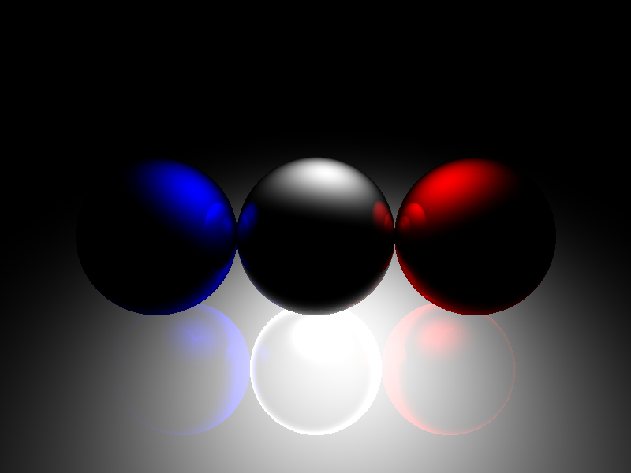
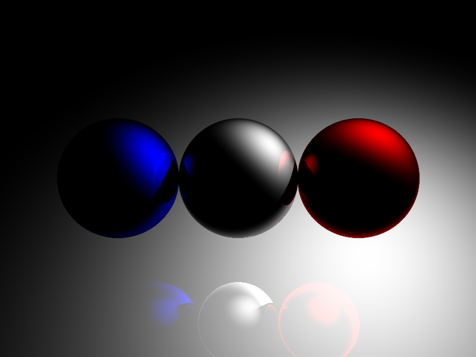

# cube

:construction:

## Run

Open html files in folder `examples`.

## Develop & build

### Dependencies

1. node.js and npm are required
2. `npm i browserify -g`
3. `npm i babelify -g`

### Build Source

1. edit codes in folder `src` (ES6)
2. `npm run build` (which generates `bundle.js`)

### Results

